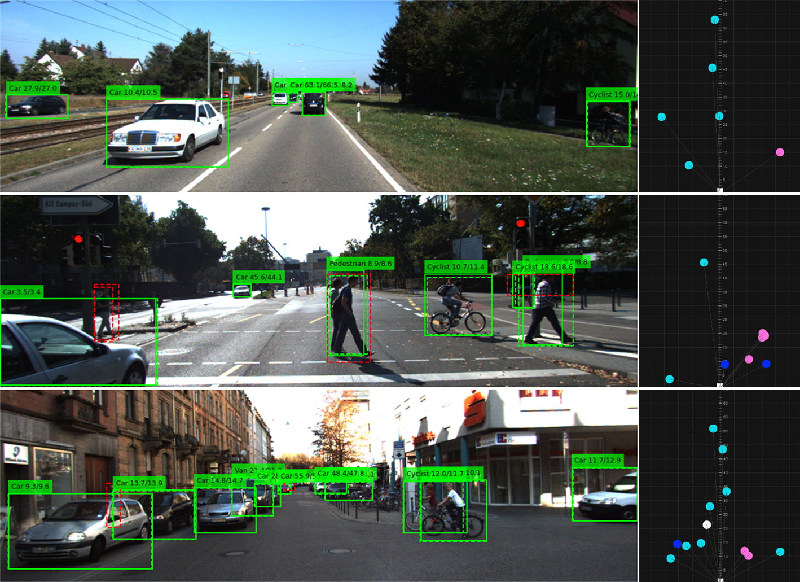
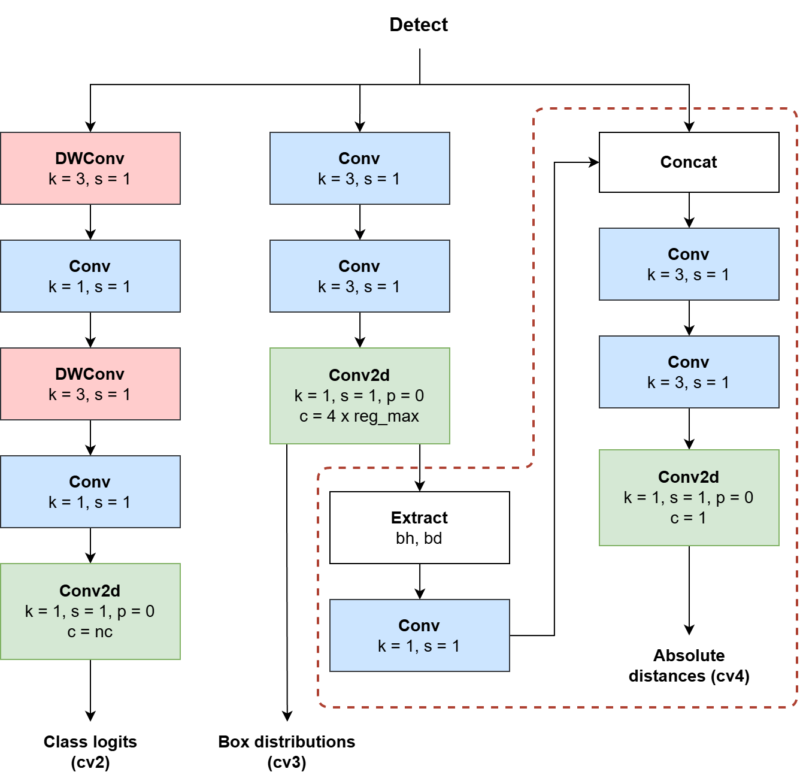
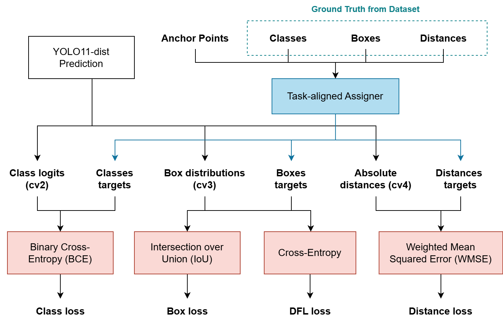
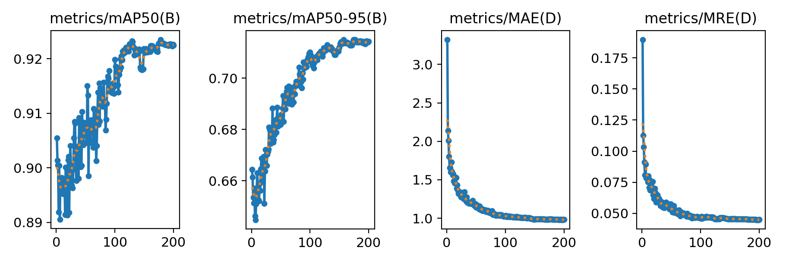

<div align="center">
  <h1>YOLO11-dist: Efficient Monocular Distance Estimation</h1>
</div>

Normally, YOLO models answer two questions:

- **What is the object?** (classification)
- **Where is it in the image?** (bounding box)

This modified model, **YOLO11-dist**, adds a third one:

- **How far away is the object in the real world?**

And it does this using **only a single RGB camera**.



# 🔎 Overview

Many safety systems such as ADAS (Advanced Driver Assistance Systems) need accurate distance information to avoid collisions. However, most reliable distance sensing solutions rely on sensors like LiDAR, which can cost hundreds or thousands of dollars. If distance can be estimated reliably from a relatively cheaper monocular camera, safety features could become much more accessible and easier to deploy.

However, estimating the absolute distance of objects from a single RGB camera is a challenging problem because depth information is not explicitly available in images. Previous approaches such as Dist-YOLO and DECADE address this problem by either:
* extending YOLO prediction vectors (modifying the architecture), or
* using multi-stage pipelines combining detection and regression modules.

This project proposes a modified YOLO11 architecture where distance estimation is integrated directly into the detection head, allowing the model to predict:
* bounding box location
* object class
* absolute distance
simultaneously.

The approach leverages both feature maps directly from the neck as well as geometric cues from bounding box dimensions (height and diagonal), which were found to have a strong correlation with object distance.

This research was developed as part of my undergraduate thesis at Universitas Gadjah Mada (UGM).

# 🧠 Architecture

The main idea of this work is simple:

Instead of building a separate distance estimation network, **distance prediction is integrated directly into the YOLO detection head**.

YOLO normally predicts:
```
[x, y, w, h, class]
```

YOLO11-dist extends this to:
```
[x, y, w, h, class, distance]
```

Each detected object now also has an absolute distance estimate (in meters).

### Modified Detection Head

YOLO11 uses a decoupled head structure for classification and localization.



This project introduces a **third prediction branch**:

```

cv2 → classification
cv3 → bounding box regression
cv4 → distance estimation   ← added

````

The new **cv4 branch** predicts the absolute distance for each detected object.

### Feature Fusion for Distance Estimation

Estimating distance from a single 2D image is inherently ambiguous.

To make the prediction more stable, the distance head does not rely solely on convolutional features.  
It also incorporates **geometric cues derived from the predicted bounding box**, specifically:

- bounding box **height**
- bounding box **diagonal length**

These geometric signals correlate strongly with distance in perspective images.

An ablation study in the thesis shows that combining:

- **raw feature maps**
- **bounding box geometry**

produces significantly better distance predictions than using features alone.

### Distance Loss Function

Distance prediction is trained using a **Weighted Mean Squared Error (WMSE)** loss.

The weighting prioritizes **closer objects**, since errors at short range are much more critical for collision avoidance.



# 📊 Dataset and Evaluation

The model is trained and evaluated using the **KITTI dataset**, one of the standard benchmarks for autonomous driving research.

Distance estimation focuses on objects within a **0–100 meter range**, which is the most relevant region for driving safety.



### Detection Performance

| Metric | Value |
|------|------|
| Precision | 91.9% |
| Recall | 86.5% |
| mAP50-95 | 0.714 |

### Distance Estimation Performance

| Metric | Value |
|------|------|
| Mean Absolute Error (MAE) | 0.981 m |
| Mean Relative Error (MRE) | 4.48% |

### Edge Device Performance

The model was also tested on a **Raspberry Pi 5** using the NCNN inference backend.

| Device | FPS |
|------|------|
| Raspberry Pi 5 (CPU, NCNN) | 10.7 FPS |

This demonstrates that the approach remains **lightweight enough for embedded systems**.

# 📈 Comparison with Previous Methods

We compare **YOLO11n-dist** against previous monocular distance estimation approaches.

| Method | Params (M) | FLOPs (B) | MAE (m) | MRE |
|------|------|------|------|------|
| Dist-YOLO | 42.6 | N/A | 2.49 | 0.110 |
| DECADE | 3.3 | 8.7 | 1.38 | 0.073 |
| YOLO11n-dist (Ours) | 2.67 | 6.7 | 0.981 | 0.045 |

YOLO11n-dist achieves:

- **60.8% lower MAE than Dist-YOLO**
- **28.9% lower MAE than DECADE**

while also using **fewer parameters** than both models.

# 🚀 Quick Start

### Installation

Install dependencies the same way as the standard Ultralytics repository:

```bash
pip install ultralytics
````

## Dataset Format

The label format extends the standard YOLO format by appending the 3D distance values:

```
<class_id> <x_center> <y_center> <width> <height> <dx> <dy> <dz>
```

Where:

* `dx`, `dy`, `dz` are object distances in meters
* the model primarily learns from **dz (longitudinal distance)**

# Training Procedure

Training follows a **two-stage curriculum learning strategy**.

### Stage 1 — Object Detection

First train the model as a normal detector.

```python
from ultralytics import YOLO

model = YOLO("yolo11n.yaml")
model.load("yolo11n.pt")

model.train(
    data="KITTI.yaml",
    epochs=200,
    imgsz=640
)
```

### Stage 2 — Distance Estimation

Then train the distance prediction head.

The backbone is partially frozen to preserve detection performance.

```python
model = YOLO("yolo11n-dist.yaml")
model.load("runs/train/weights/best.pt")

model.train(
    data="KITTI.yaml",
    epochs=200,
    freeze=9,
    max_dist=100.0
)
```

Distance-sensitive augmentations such as scaling and perspective transformations are disabled during this stage.

# Validation

Evaluate both detection and distance performance:

```python
model = YOLO("yolo11n-dist_best.pt", task="dist")

metrics = model.val(data="KITTI.yaml")
```

Metrics include:

* detection mAP
* distance MAE
* distance MRE

# Inference

Example inference code:

```python
from ultralytics import YOLO

model = YOLO("yolo11n-dist_best.pt", task="dist")

results = model.predict(
    source="test_video.mp4",
    device="cpu"
)

for result in results:
    boxes = result.boxes
    distances = result.distances
```

Each detection returns:

```
[class, bounding box, estimated distance]
```

# 📚 Further Reading

* Ultralytics YOLO11 – base detection framework
* KITTI Vision Benchmark Suite – Geiger et al. (2012)
* Dist-YOLO (2022)
* DECADE (2024)
